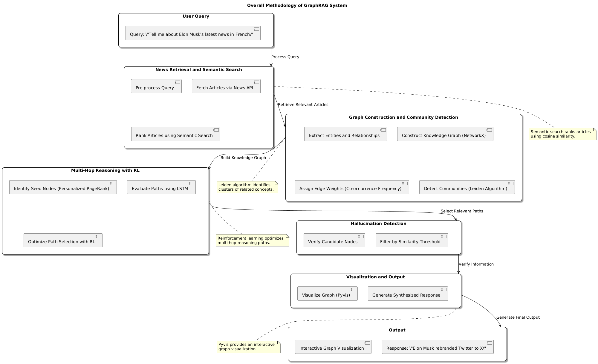
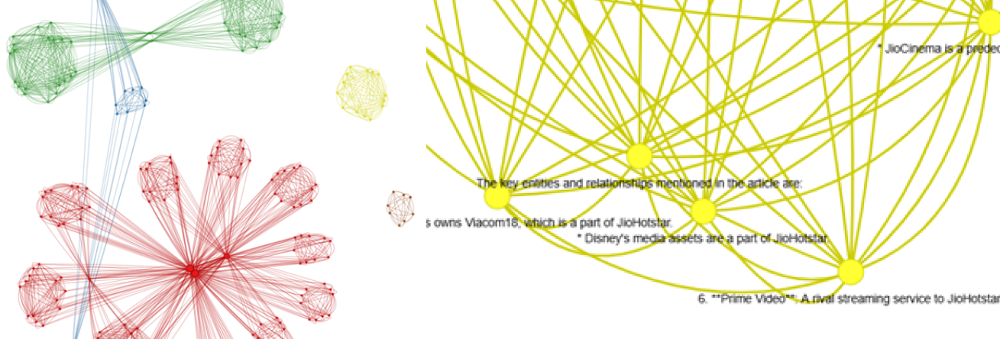
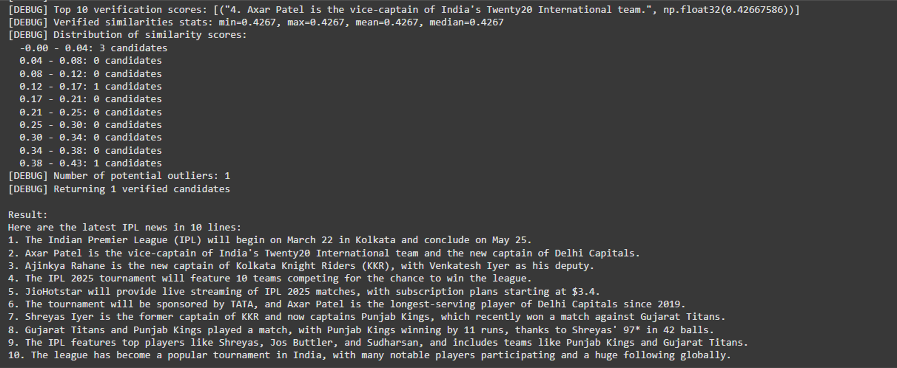

# 📊 PathGRAG: Hybrid Framework for Multi-Hop Reasoning using Graphs and Reinforcement Learning


---

## 🚀 Overview

**PathGRAG** is a research-focused project that addresses the challenge of hallucination and factual inconsistency in Retrieval-Augmented Generation (RAG) systems. It combines:
- **LSTM**-based path embeddings  
- **Reinforcement Learning** for optimal reasoning path selection  
- **Community Detection** in Knowledge Graphs  
- **Multi-hop Reasoning and Hallucination Filtering**

Built and evaluated using **live multilingual news data** with **LLaMA-3**, semantic search, and `NetworkX`, the model outperforms baseline RAG and GraphRAG architectures.

```
While initially tested using real-time news data via APIs for multilingual benchmarking, the PathGRAG framework is designed to 
extend into high-stakes domains such as medical and clinical data analysis. Its hallucination detection, multi-hop reasoning, 
and knowledge graph validation make it ideal for answering patient queries accurately by referencing verified health records
and structured clinical knowledge — minimizing the risk of misinformation.

```
---

## 📌 Key Features

✅ LSTM + Reinforcement Learning-based Path Optimization  
✅ Knowledge Graph Construction with Community Detection  
✅ Multi-hop Reasoning and Hallucination Filtering  
✅ Real-time Multilingual News Retrieval  
✅ RAGAS-based Output Evaluation  
✅ Visualization with Pyvis & NetworkX

---

## 🧠 Architecture

<p align="center">
  
</p>

---

## 🧪 Working Demo

<p align="center">
  
</p>

<p align="center">
  
</p>

<p align="center">
  
</p>

---

## 🧰 Tech Stack

- Google Colab + Python 3.10+
- Langchain + LLaMA-3-70B (via HuggingFace)
- Sentence Transformers (`all-MiniLM-L6-v2`)
- NetworkX, Pyvis
- Reinforcement Learning with custom reward function
- NewsAPI for real-time news

---

## 📊 Results

| Model        | BLEU | BERT | ROUGE | Cosine Similarity | RAGAS |
|--------------|------|------|--------|-------------------|--------|
| RAG Baseline | 0.16 | 0.59 | 0.35   | 0.81              | 0.67   |
| GraphRAG     | 0.47 | 0.61 | 0.45   | 0.85              | 0.79   |
| **PathGRAG** | **0.49** | **0.63** | **0.47** | **0.91** | **1.0** |

---


## 🤝 Acknowledgements

This research was developed at **Vellore Institute of Technology, Chennai**,  
under the guidance of **Brindha Subburaj** and team.

